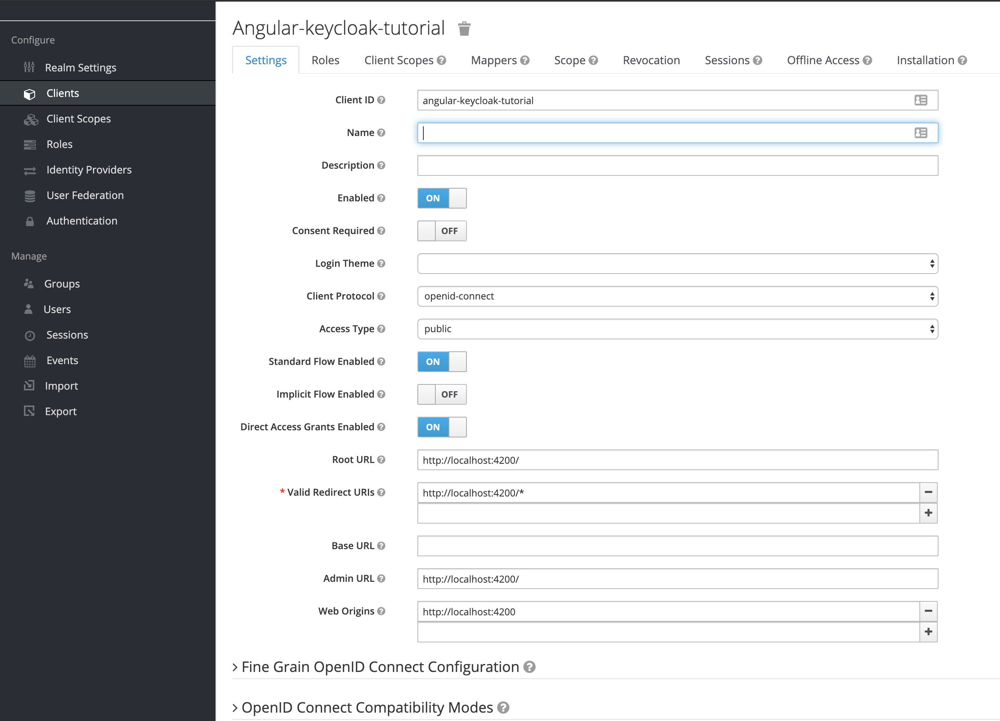
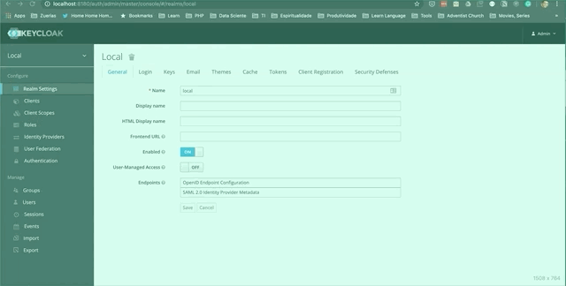
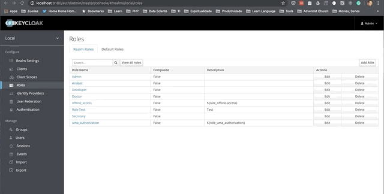

# Angular Keycloak Demo App

## About

Tutorial demonstrating how to configure an application with authentication and authorization through Keycloak.

This demo we utilize a keycloak-angular lib, more details [here](https://github.com/mauriciovigolo/keycloak-angular).

## Quickstart

1.  Clone the [angular-keycloak-demo](https://github.com/humbertodosreis/angular-keycloak-demo) repository.

```
git clone https://github.com/humbertodosreis/angular-keycloak-demo
```

2.  Run project.

```
ng serve --open
```

### Keycloak

1. Create a user.


2. Create and configure a client in Keycloak like image as below



### Angular

1. Then configure the environment.ts files to your Keycloak Instance

> ./src/environments/environment.ts

```typescript
import { KeycloakConfig } from "keycloak-angular";

// Add here your keycloak setup infos
const keycloakConfig: KeycloakConfig = {
  url: "KEYCLOAK-INSTANCE-URL", // http://localhost:8080/auth
  realm: "REALM-NAME", // your realm: keycloak-sandbox
  clientId: "CLIENT-ID-NAME", // angular-keycloak-tutorial
};

export const environment = {
  production: false,
  // ...
  keycloakConfig,
};
```

2. Initialize KeycloakService

In this tutorial, we go to set up the initialization the KeycloakService using the ngDoBootstrap.
, another way is using the APP_INITIALIZER, [see plugin's docs for more details
](https://github.com/mauriciovigolo/keycloak-angular#setup).

3. Setup app.module.ts

> ./src/app.module.ts

```typescript
import { NgModule, DoBootstrap, ApplicationRef } from "@angular/core";
import { KeycloakAngularModule, KeycloakService } from "keycloak-angular";

const keycloakService = new KeycloakService();

@NgModule({
  imports: [KeycloakAngularModule],
  providers: [
    {
      provide: KeycloakService,
      useValue: keycloakService,
    },
  ],
  entryComponents: [AppComponent],
})
export class AppModule implements DoBootstrap {
  async ngDoBootstrap(app) {
    const { keycloakConfig } = environment;

    try {
      await keycloakService.init({ config: keycloakConfig });
      app.bootstrap(AppComponent);
    } catch (error) {
      console.error("Keycloak init failed", error);
    }
  }
}
```

4. Create a app.guard

> ./app/app-auth.guard.ts

```typescript
import { Injectable } from "@angular/core";
import {
  CanActivate,
  Router,
  ActivatedRouteSnapshot,
  RouterStateSnapshot,
} from "@angular/router";
import { KeycloakService, KeycloakAuthGuard } from "keycloak-angular";

@Injectable()
export class AppAuthGuard extends KeycloakAuthGuard implements CanActivate {
  constructor(
    protected router: Router,
    protected keycloakAngular: KeycloakService
  ) {
    super(router, keycloakAngular);
  }

  isAccessAllowed(
    route: ActivatedRouteSnapshot,
    state: RouterStateSnapshot
  ): Promise<boolean> {
    return new Promise(async (resolve, reject) => {
      if (!this.authenticated) {
        this.keycloakAngular.login();
        return;
      }
      console.log(
        "role restriction given at app-routing.module for this route",
        route.data.roles
      );
      console.log("User roles coming after login from keycloak :", this.roles);

      const requiredRoles = route.data.roles;
      if (!requiredRoles || requiredRoles.length === 0) {
        return resolve(true);
      } else {
        if (!this.roles || this.roles.length === 0) {
          resolve(false);
        }
        let granted: boolean = false;
        for (const requiredRole of requiredRoles) {
          if (this.roles.indexOf(requiredRole) > -1) {
            granted = true;
            break;
          }
        }
        resolve(granted);
      }
    });
  }
}
```

## Authorization

Steps below describe how to setup authorization.

### Keycloak

1. Create Roles



2. Assign Role to User



### Angular

In `src/app/app-routing.module.ts`, associate role to route

```typescript
const routes: Routes = [
  {
    path: "",
    component: HomeComponent,
  },
  {
    path: "patients",
    component: PatientsListComponent,
    canActivate: [AppAuthGuard],
    data: {
      roles: ["Secretary", "Doctor", "Role Test"],
    },
  },
];
```

## Testing


## Further Reading

* https://robferguson.org/blog/2019/12/24/getting-started-with-keycloak/
* https://robferguson.org/blog/2019/12/29/angular-openid-connect-keycloak/
* https://robferguson.org/blog/2019/12/31/angular-oauth2-keycloak/
* https://brockallen.com/2019/01/03/the-state-of-the-implicit-flow-in-oauth2/
* https://auth0.com/blog/oauth2-implicit-grant-and-spa/
* https://www.scottbrady91.com/Angular/SPA-Authentiction-using-OpenID-Connect-Angular-CLI-and-oidc-client
* https://medium.com/@sairamkrish/keycloak-integration-part-2-integration-with-angular-frontend-f2716c696a28


